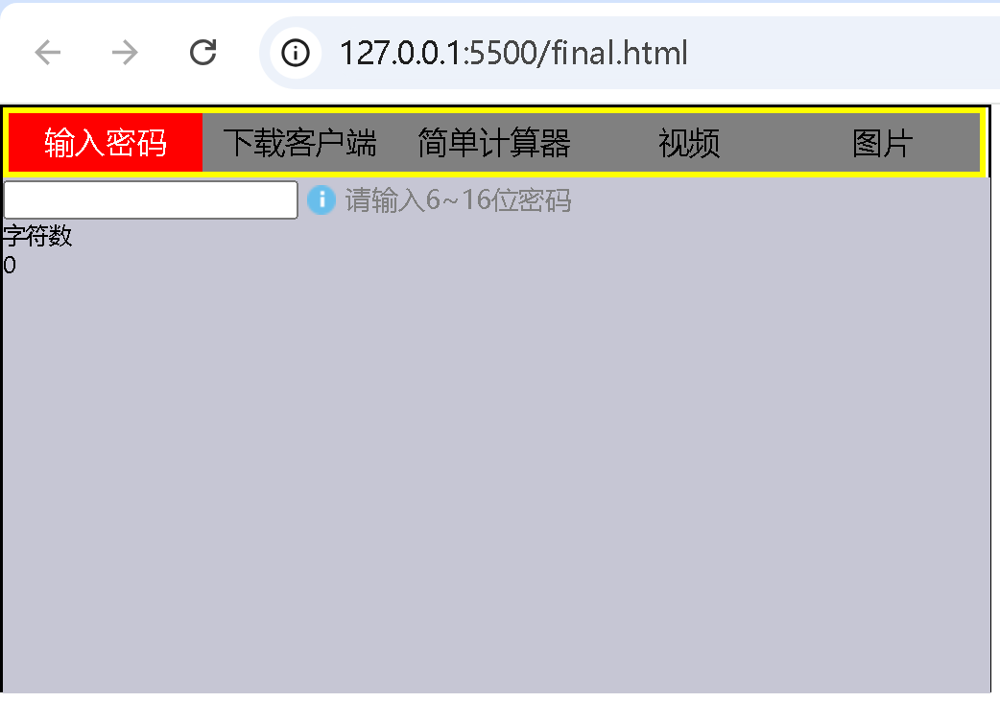
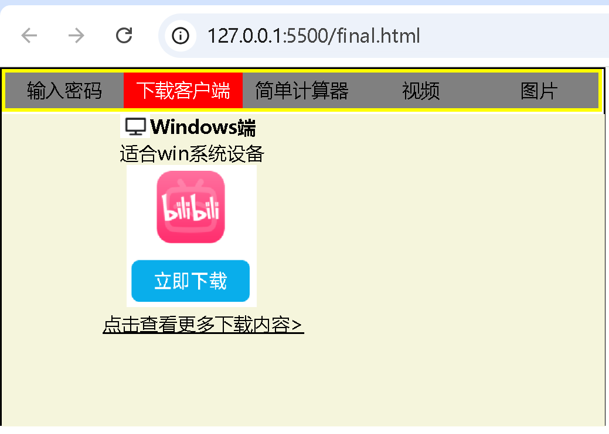
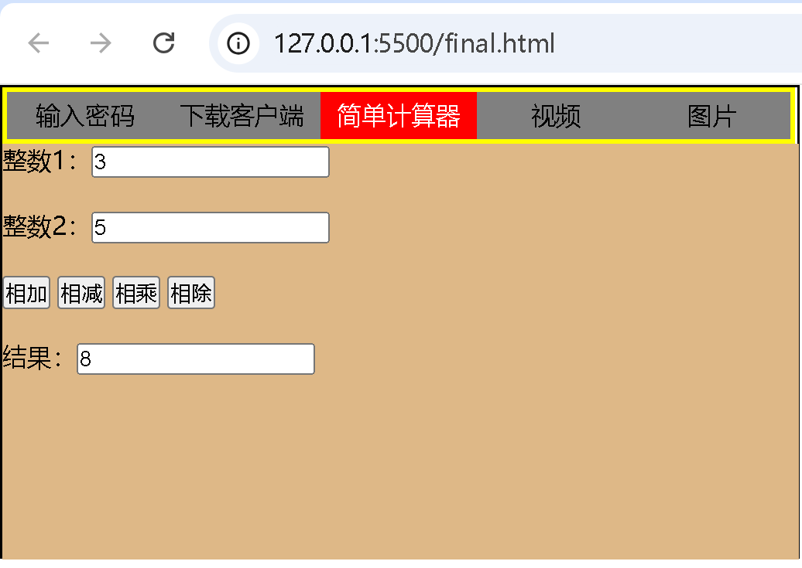
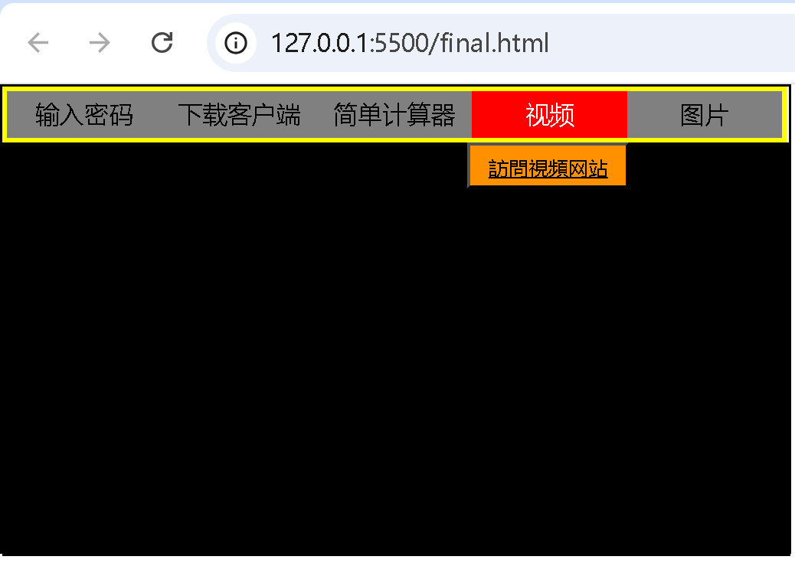
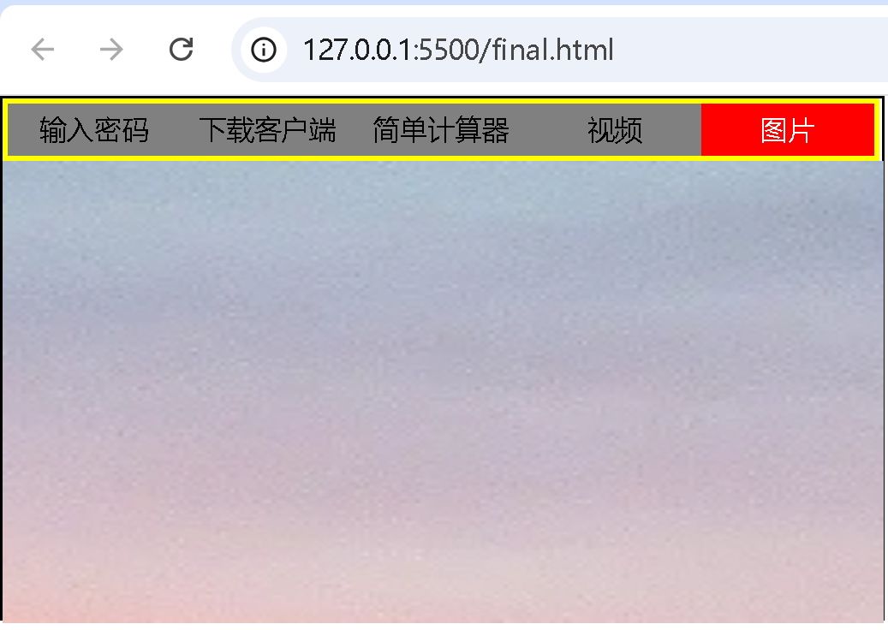

# HTML 项目说明

## 功能描述

1. **输入密码**：密码长度验证（太短、太长或正确）。

2. **下载客户端**：提供bilibili客户端的下载链接。

3. **简单计算器**：仅支持两个整数。

4. **视频**：用户可以点击访问视频网站（cctv.com）。

5. **图片**：展示一张图片。

## HTML 结构

- **整体布局**：使用一个`div`元素（id为`father`）作为整个页面的容器，其内部包含两个主要的`div`元素：`son1`（选项卡标题）和`son2`（选项卡内容）。
- **选项卡标题**：`son1`包含一个无序列表（`ul`），每个列表项（`li`）代表一个选项卡标题。
- **选项卡内容**：`son2`包含多个`div`元素（id分别为`shadow1`至`shadow5`），每个`div`代表一个选项卡的内容区域，初始时除了`shadow1`外都设置为隐藏（`display: none`）。

## JavaScript 交互

- **选项卡切换**：通过JavaScript监听每个选项卡标题的`mouseover`和`mouseout`事件，实现选项卡内容的显示和隐藏。
- **密码验证**：监听密码输入框的`oninput`事件，根据输入的密码长度更新提示信息和图标。
- **计算器功能**：为计算器按钮绑定点击事件，根据用户选择的运算类型执行相应的计算，并显示结果。

## 如何使用

1. 把项目克隆至本地。
2. 确保与HTML文件同级的目录下有`images`文件夹，并且该文件夹中包含所需的图片文件。
3. 使用浏览器打开HTML文件，即可查看和使用该网页。

## 注意事项

- 确保所有引用的图片路径正确，否则图片将无法正常显示。
- 如果需要修改或扩展功能，请确保对JavaScript代码进行相应的调整。